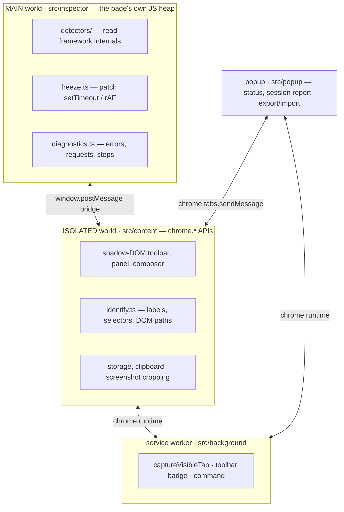
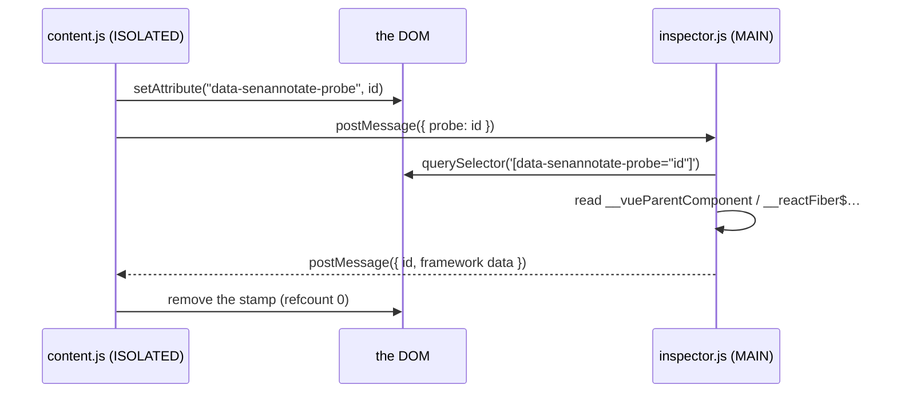

# Architecture

Everything structural about this extension follows from one fact:

> **A content script cannot see `element.__vueParentComponent`, `__reactFiber$…` or
> `__svelte_meta`.**

Chrome gives each isolated world its own view of JS properties on DOM nodes, and every
framework writes its metadata there. A content script sees the DOM; it does not see what
the page attached to it.

So the extension is split across three contexts, and most of the rules below exist to
keep that split honest.

---

## The three worlds



| Bundle | World | Entry | Owns |
|---|---|---|---|
| `inspector.js` (IIFE) | MAIN, `document_start` | `src/inspector/` | framework detectors, motion freeze, diagnostics capture |
| `content.js` (IIFE) | ISOLATED, `document_idle` | `src/content/` | shadow-DOM UI, element identification, storage, clipboard, screenshot crop |
| ↳ same bundle, child frames | ISOLATED, `document_idle` | `src/content/frames.ts` | highlight + capture only; hands drafts up to the top frame |
| `background.js` (ESM) | service worker | `src/background/` | `captureVisibleTab`, toolbar badge, keyboard command |
| `popup.js` (IIFE) | popup page | `src/popup/` | status, session report, export/import |

`src/shared/` is the only code all four import: `types.ts`, `protocol.ts` (wire protocol
and storage keys), `output.ts` (the Markdown report), `archive.ts` (export/import),
`accent.ts` (the accent colour and the two shades derived from it).

---

## Rules that fall out of this

### `world: "MAIN"` is declared in the manifest, never injected at runtime

Declarative content scripts are **exempt from the page's CSP**. An injected `<script>`
tag is not — it would be blocked on any app with a strict `script-src`, which is most of
the apps worth annotating.

### The inspector must not snapshot anything at module load

It runs at `document_start`, before the app mounts. There is nothing to snapshot yet. It
is purely reactive: it sits on the bridge and answers.

### Freeze and diagnostics have to live in MAIN

Patching `setTimeout` from ISOLATED patches only that script's own timers. The page's
animation loops and its `console` are in another heap entirely.

### DOM nodes cannot cross `postMessage`

So the content script **stamps** the target:



Stamps are **reference-counted**, because a hover lookup and a click capture can be in
flight on the same element at once. Bridge RPC times out at **500 ms** and resolves
`null`, so a page that never answers degrades to a note with no framework data rather
than hanging.

### The content script mirrors the diagnostics buffers

Copying a report must not `await` before touching the clipboard: an await spends the
click's user activation and `navigator.clipboard.writeText` then silently stops working.
So the content script keeps its own copy, pushed to it by the inspector, rather than
fetching on demand.

---

## The overlay

The whole UI lives in **one shadow host** attached to `documentElement` — not `body`,
which an app may replace — marked `data-senannotate-ui` so freeze CSS and hit-testing can
exclude it. The host is `pointer-events: none`.

**Our UI must never deliver pointer events, or take focus, from the page.** `createUiRoot`
stops nine pointer event types plus `focusin`/`focusout` at the host, and cancels
`mousedown` (text fields exempted) so a click takes no focus.

Without these, a toolbar click reads to the page as an "outside click" and dismisses its
modal, or trips its focus trap into stealing the composer's keystrokes. Both happened.
Keyboard events and `pointermove` are deliberately **excluded** from the list, because
the page needs those.

---

## The `all_frames` branch

Both content scripts run with `all_frames: true`. `src/content/index.ts` therefore ends
in a branch, and it is the most important line in the file:

```ts
if (isTopFrame()) installTopFrame();
else if (isFrameWorthInstrumenting()) installChildFrame(() => settings);
```

**Everything with a side effect lives inside `installTopFrame()`** — `createUiRoot()`, the
three UI constructors, `chrome.runtime.onMessage`, every `listen()`, `boot()`.

Adding a new module-scope `listen(...)` or constructor to that file puts it in **every
iframe on the page**: a second toolbar, a second answer to the popup's `get-status`, a
second owner of the annotations.

`isFrameWorthInstrumenting()` is what skips frames smaller than 50×50 and the challenge
widgets — see [[Iframes Modals and Edge Cases]].

---

## Identification is framework-free

`src/content/identify.ts` — labels, selectors, DOM paths — reads **only the DOM**. It
needs no bridge round trip and works identically with no framework at all.

That is why a page with no framework still produces a complete, useful note, and why the
hover label appears instantly while the component chain arrives a round trip later.

---

## Storage

| | |
|---|---|
| Annotations | `chrome.storage.local`, keyed on `origin + pathname` |
| Settings | `chrome.storage.sync` |

Both key names live in `shared/protocol.ts`, because the popup needs the same strings.
The query string is excluded from the annotation key on purpose: `/orders?page=2` and
`/orders?page=3` are the same screen.

---

## Import direction

**Nothing in `popup/` or `background/` may import from `content/`.**

That inversion is what put `archive.ts` in `shared/` rather than next to
`content/storage.ts`, and it is why `accent.ts` returns *colours* rather than CSS
variable names — the overlay calls them `--sa-accent*` and the popup calls them
`--accent*`.

---

## Layout

```
src/
├── shared/       types, wire protocol, Markdown generation, export/import, accent
├── inspector/    MAIN world — freeze, diagnostics
│   └── detectors/  one file per framework + a dispatcher
├── content/      ISOLATED world — capture, storage, UI, frame bridge
├── background/   service worker
└── popup/        status, session report, export/import
```

**Zero runtime dependencies.** Build-time: `esbuild` and `typescript`, targeting
`chrome111`.

---

## Further reading

The design record in
[`docs/`](https://github.com/thangnm93/SenAnnotate/tree/main/docs) is one folder per task
— `brief.md`, `context.md`, `plan.md`, `changelog.md` — written *during* the work,
including what went wrong and which assumptions turned out false.

Start with [`docs/README.md`](https://github.com/thangnm93/SenAnnotate/blob/main/docs/README.md),
which gives a reading order.
[`docs/history/vuetation/context.md`](https://github.com/thangnm93/SenAnnotate/blob/main/docs/history/vuetation/context.md)
is the best explanation of the three-world split and ranks the four Vue source-resolution
strategies best to worst.
