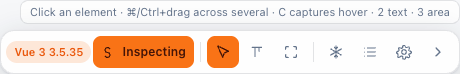
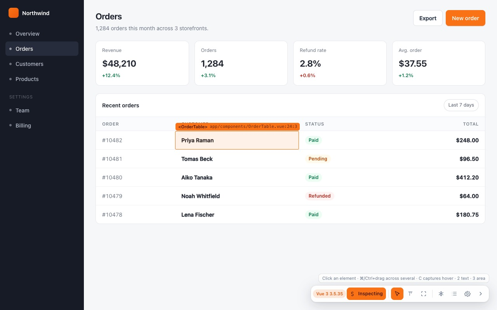
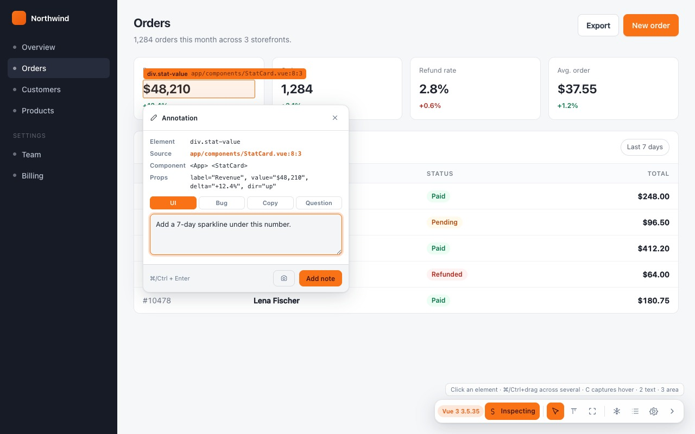
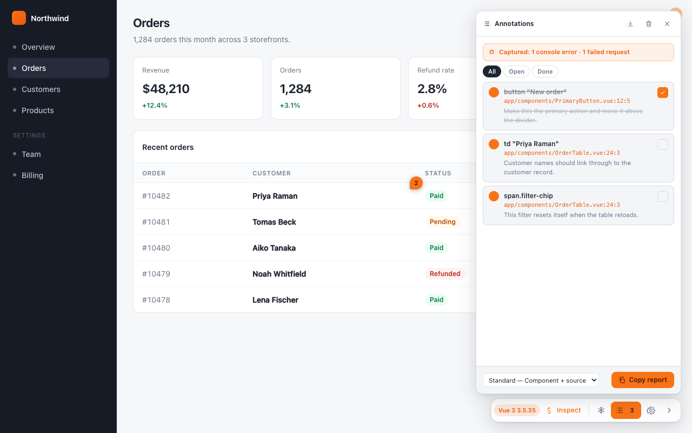

# Quick Start

From installed to a report on your clipboard. Five steps, about a minute.

Already installed? Open any ordinary web page — the extension deliberately does not run
on `chrome://` pages, the Chrome Web Store, or the PDF viewer. If you have not installed
it yet, see [[Installation]].

---

## 1. Turn on inspect mode

Press <kbd>Alt</kbd>+<kbd>Shift</kbd>+<kbd>S</kbd>, or click **Inspect** on the toolbar
in the bottom-right corner.



Two things to notice, because they mean you never have to memorise this page:

- **The line above the pill always names what the current mode does** and which keys
  switch to the others. It changes as you change mode.
- **Every button names itself on hover** — and on keyboard focus — so the icons do not
  have to be learned either.

The badge on the left (`Vue 3 3.5.35` above) is the framework the extension found on
this page. No badge means no framework was detected, which is fine: everything below
still works, and the report simply carries no component data.

---

## 2. Point at something

Move the pointer. The element under it is outlined, and a label names it — with the
component and source file when the page's framework records them.



That label is the extension telling you, before you commit, exactly what it will put in
the report.

---

## 3. Click it, and write the note

The composer opens already carrying the element, its source, the component chain and the
owner's props. You supply the sentence.



Pick a **type** — Bug, UI, Copy, Question — which reaches the report heading and colours
the pin. Then **Add note**, or <kbd>⌘</kbd>/<kbd>Ctrl</kbd>+<kbd>Enter</kbd>.

> **The one shortcut worth learning now:** if the thing you want to annotate *disappears
> when you click* — a dropdown, a hover menu, a tooltip — hover it and press <kbd>C</kbd>
> instead. It captures whatever is under the pointer without a click, so the menu stays
> open while you type. [[Selecting Elements]] explains why freeze does not help here.

---

## 4. Repeat, then open the list

Annotate as many as you need. Press <kbd>A</kbd> or click the list icon on the toolbar.



Three things are worth pointing at in that picture:

- **The banner at the top** — *"Captured: 1 console error · 1 failed request"*. Those
  were recorded automatically, from before the app's first line ran. See
  [[Diagnostics and Privacy]].
- **The struck-through first note** is ticked **done**. Ticking is how you triage; the
  `All · Open · Done` filter above the list is how you narrow. See [[Triage]].
- **The dropdown at the bottom** is the detail level. It decides how much each note
  carries in the report.

---

## 5. Copy the report

**Copy report**. Paste it into Claude Code, Cursor, a Jira ticket, or a message.

```markdown
## Page feedback: /orders
**Stack:** Vue 3 3.5.35  ·  **Viewport:** 1280×800

### 1. [ui] button "New order"
**Source:** app/components/PrimaryButton.vue:12:5
**Components:** <App> <PrimaryButton>
**Location:** .actions > .primary-button
**Feedback:** Make this the primary action and move it above the divider.
```

Prefer a file? **.md** next to it saves the same text. Annotated several pages in one
session? The extension popup has **Copy session report**, which covers all of them at
once — see [[Sessions Export and Import]].

---

## What just happened, in one paragraph

The notes are stored per `origin + pathname` in `chrome.storage.local`, so they survive a
reload and come back when you return to the same screen. The query string is deliberately
excluded, so `/orders?page=2` and `/orders?page=3` share one set. Nothing was sent
anywhere — there is no account and no server.

---

## Where to go next

| You want | Page |
|---|---|
| Every way of selecting — text, several at once, hover capture | [[Selecting Elements]] |
| Attach a screenshot with a box or an arrow on it | [[Screenshots and Markup]] |
| Change how much detail the report carries | [[The Report]] |
| Turn things off, change the accent colour, hide the overlay | [[Settings]] |
| One table of every key | [[Keyboard Reference]] |
| It is not doing what this page says | [[Troubleshooting]] |
