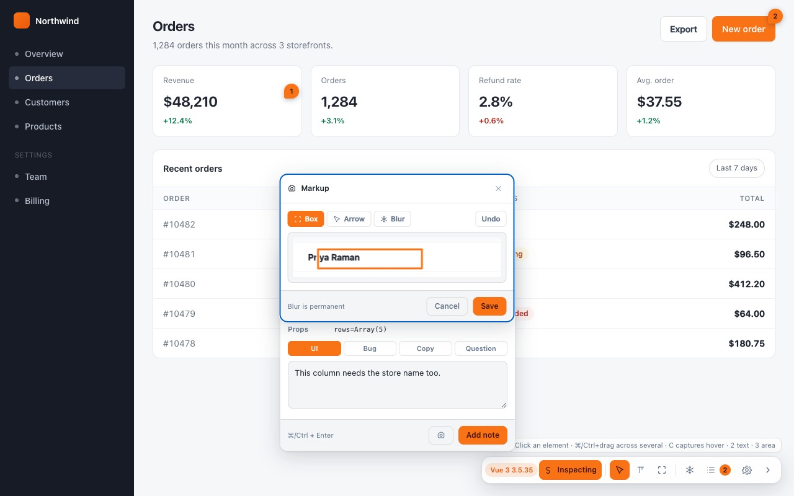

# Screenshots and Markup

The camera button in the composer photographs the element and opens a small editor before
anything is attached — so the image you send points at the thing you mean.



---

## The crop

The shot is a crop of the element's own box, not the whole viewport. A note about one
button produces a picture of that button in its surroundings, which is what a reader
needs, and a fraction of the bytes of a full-page capture.

An element with no rendered area cannot be photographed — the capture refuses with
*"Nothing to capture"* rather than saving a zero-pixel file.

---

## The three tools

| Tool | Does | Reversible |
|---|---|---|
| **Box** | Draws a rectangle in the accent colour. | Yes |
| **Arrow** | Draws an arrow. | Yes |
| **Blur** | Obscures a region. | **No** |

Boxes and arrows use the accent colour from [[Settings]], so markup matches the rest of
the UI. Screenshots you already saved keep the colour they were drawn in — changing the
accent later does not rewrite history.

### Blur is permanent, on purpose

**Blur resamples the region rather than filtering it.** The pixels are genuinely gone
from the saved file — there is no original underneath, no CSS filter to remove, and no
way to recover what was there.

That is the point. A tester photographing a real screen is photographing real customer
data, and a blur you can undo is not a redaction. Blur the name, the email, the card
number, then attach the file without having to think about who will see it.

---

## How the shot reaches the report

A setting, because the right answer depends on where the report is going.

| | Report carries | Cost | Use when |
|---|---|---|---|
| **Link to the saved file** *(default)* | `~/Downloads/senannotate-….png` | a few dozen bytes | The report goes to a **coding agent** — Claude Code, Cursor — which opens the file with its own file tool. |
| **Embed in the report** | a downscaled JPEG as a `data:` URI | ~60–120 KB a shot | The report goes somewhere that will not have your Downloads folder: Slack, Jira, an email. |

**The PNG is saved either way.** Embedding adds a copy inside the Markdown; it does not
replace the file.

Embedded images are downscaled to **900px wide** before encoding. The scale is applied on
the way into the canvas rather than after, so a 2× Figma export never allocates a
full-size bitmap first.

Change it under *Screenshots* in [[Settings]].

---

## Reference images

Separate from the screenshot, and answering a different question. A screenshot says
*this is what it looks like*; a reference image says *this is what it should look like
instead* — a Figma frame, a competitor's page, a mock.

Paste one into the composer with <kbd>⌘</kbd>/<kbd>Ctrl</kbd>+<kbd>V</kbd>, or attach a
file. Up to three per note.

They are downscaled and re-encoded the same way, for the same reason: three full-size
Figma exports would fill the page's whole storage budget on their own.

> Reference images are part of a change that is on a branch rather than in a release at
> the time of writing. Check the [changelog](https://github.com/thangnm93/SenAnnotate/blob/main/CHANGELOG.md)
> for the version you are running.

---

## What the report says

```markdown
**Screenshot:** ~/Downloads/senannotate-1763029180000.png
```

or, embedded:

```markdown

```

An agent given the first form opens the file. A human given the second sees the picture
inline wherever the Markdown is rendered.

---

## Two limits worth knowing

**A screenshot pins the note to its element.** Retargeting a note with a screenshot
already attached is refused — the image is a crop of one element's box, and keeping it
after moving to another would put a picture of the wrong thing in the report. Retake the
screenshot after choosing the element.

**Capture needs the tab visible.** The shot comes from `chrome.captureVisibleTab` in the
service worker, so a background tab cannot be photographed. In practice you are looking
at the page you are annotating, so this is invisible.
