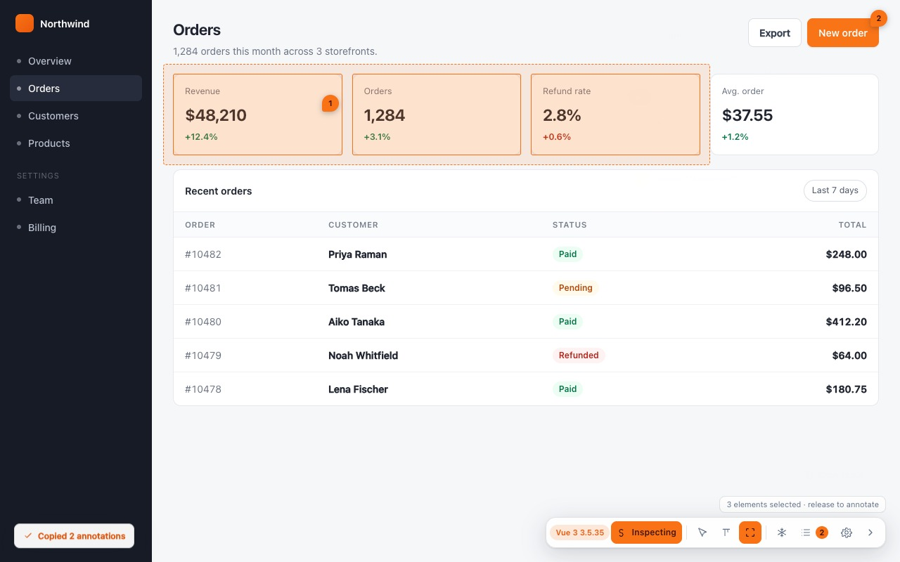
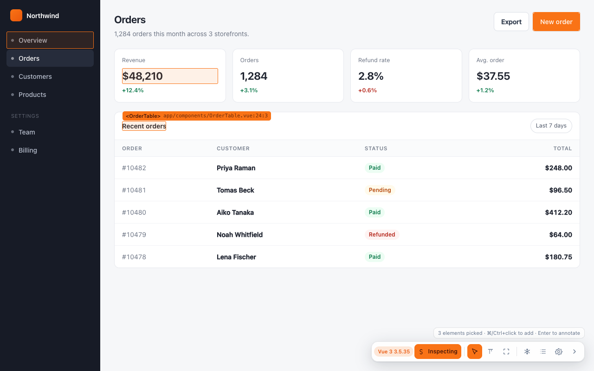

# Selecting Elements

Five ways to say *this one*. They exist because "click the thing" stops working in five
different situations, and each of these fixes one of them.

| Gesture | Use when |
|---|---|
| **Click** | The ordinary case. |
| <kbd>C</kbd> **while hovering** | Clicking would close the thing — a menu, a tooltip, a `:hover` state. |
| **Mode 2, then select text** | The complaint is about wording. |
| <kbd>⌘</kbd>/<kbd>Ctrl</kbd>**+drag** | Several elements near each other. |
| <kbd>⌘</kbd>/<kbd>Ctrl</kbd>**+click each** | Several elements nowhere near each other. |

---

## Click

Hover outlines the element and labels it with what will go in the report. Click opens the
composer. That is the whole gesture.

The label is anchored to the element's left edge, so on an element near the right edge of
the viewport it is clamped rather than clipped.

---

## <kbd>C</kbd> — capture what you are hovering

**This is the one worth knowing about.**

Clicking is how you annotate, and clicking is also what closes the thing you wanted to
annotate: a dropdown, a hover menu, a tooltip, a submenu, anything styled `:hover`.
<kbd>C</kbd> captures whatever the pointer is over **without pressing anything**, so the
menu is still open while you type the note.

> **Freeze does not help here, and it is worth understanding why.** Freeze parks timers
> and animation frames. A dropdown that closes on mouse-out is driven by *pointer events*,
> not by time — nothing is on a timer, so there is nothing for freeze to park. That is
> a different problem needing a different key.

---

## Text

Press <kbd>2</kbd>, then select a range the way you would select any text. The composer
opens with a **Text** row carrying exactly what you selected.

The element reported is the one that *owns* the text, so the report still names a
component and a source file — a copy change stays as actionable as a layout one.

Text selection works inside iframes. The marquee does not; see
[[Iframes Modals and Edge Cases]].

---

## Marquee — drag a box

Either press <kbd>3</kbd>, or hold <kbd>⌘</kbd>/<kbd>Ctrl</kbd> and drag without leaving
the default mode.

**The box takes everything it fully contains, at the shallowest level contained.** Draw
around three cards and you get three cards — not the dozen `
`s inside them, and not
the container around them. Elements the box merely *clips* are left out.

Three details that matter in practice:

- The selection is highlighted live while you drag and counted in the hint line, so you
  can adjust before letting go.
- The box only starts once the pointer has actually **moved**, so a modifier-click with a
  shaky hand still collects a single element rather than drawing an empty box.
- A modifier drag **commits what was already picked** along with the box, so the two
  multi-select gestures compose.

Zero-size and hidden elements are skipped: an element with no rendered area breaks the
highlight, the screenshot crop and the pin position all at once, so nothing selects one.

---

## Multi-pick — <kbd>⌘</kbd>/<kbd>Ctrl</kbd>+click each

When the things you mean are nowhere near each other — a badge in the header, a label in
the form, a button in the footer, all the wrong grey — pick them one at a time.

- Each stays highlighted, and the hint line counts them:
  `3 elements picked · ⌘/Ctrl+click to add · Enter to annotate`.
- <kbd>⌘</kbd>/<kbd>Ctrl</kbd>+click one **again** takes it back out.
- Finish by **clicking the last element normally** — which adds it *and* opens the
  composer — or by pressing <kbd>Enter</kbd> to take the set as it stands.
- <kbd>Esc</kbd> drops the set without leaving inspect mode.

**On macOS use <kbd>⌘</kbd>.** <kbd>Ctrl</kbd>+click there is a right-click, which is the
operating system's gesture and not available to reassign.

The order is kept: the first element picked is the one the report leads with, and the
others are listed under it as part of the same note.

---

## What ends up in the report

One note, however many elements it covers. A multi-element note reports the first element
in full and names the rest, with the count — `3 elements` — rather than repeating the
whole block three times. See [[The Report]].

---

## Our own UI is never selectable

The whole overlay lives in a shadow root marked `data-senannotate-ui`, and hit-testing
excludes it. You cannot annotate the toolbar, and hovering it does not highlight anything
underneath.

This also means the extension never steals a click from the page: nine pointer event
types plus `focusin`/`focusout` are stopped at the shadow host, and `mousedown` is
cancelled (text fields exempted) so clicking the toolbar takes no focus. Without that, a
toolbar click reads to the page as an "outside click" and dismisses its modal — which is
exactly what used to happen. See [[Iframes Modals and Edge Cases]].
