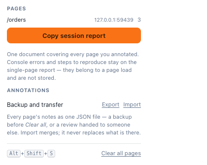

# Sessions, Export and Import

The extension popup — the orange **S** in Chrome's toolbar — carries the things that are
about *every* page rather than the one you are looking at.

---

## Pages

Every page you have annotated, with its host and its note count. This is the honest
answer to *"what did I actually cover?"* at the end of a pass.

Notes are keyed on `origin + pathname`, so this list has one row per screen — not per
visit, and not per query string.

---

## Copy session report

One Markdown document covering **every page** in that list, rather than the page you
happen to be on.

Use it when the review spans a flow — sign-up, then onboarding, then the dashboard —
which is most reviews. Pasting three separate reports loses the order they were found
in and makes the reader reconstruct the journey.

### One thing it deliberately does not carry

**Console errors and reproduction steps do not appear in the session report.** They
belong to a page *load* and are not stored — the extension keeps them in memory for the
page you are on and mirrors them into the report you copy there.

So: if the diagnostics matter for a particular page, copy that page's report from the
panel while you are on it. The session report is for the notes.

---

## Export

Every page's notes as **one JSON file**.

Reach for it:

- **before a Clear all** — a backup that costs one click;
- **to hand a review to someone else** — they import it and see your notes on their own
  machine, pinned to the same elements;
- **to move between machines** — notes are in `chrome.storage.local`, which does *not*
  sync (settings do; notes are too large);
- **before uninstalling** — removing the extension deletes the notes with it.

The file contains the notes, their types, statuses, elements, selectors, component
chains and source lines. It does not contain the pages themselves.

---

## Import

**Import merges. It never replaces what is already there.**

Notes are added to whatever each page already holds, so importing a colleague's review
onto a page where you have your own notes gives you both sets, not theirs.

Malformed entries are skipped rather than aborting the import, and the summary line says
how many. An entry has to carry at least an id, a comment, an element and a selector to
be taken — an entry without a selector would throw when the extension tried to resolve
the element, which is a corrupted note rather than a partial one.

### Importing a review captured somewhere else

A review captured on `staging.example.com` imports at `staging.example.com` keys, so on
`localhost:3000` you would see nothing.

Tick the box to **remap onto the site in the current tab** and the notes are filed under
this tab's origin instead. The confirmation names the origin they landed on, because
which origin they landed on is the one thing a remap can get wrong.

The remap needs a real site to land on. On a `chrome://` page or the extension's own
pages there is no origin a content script could ever read, and the import says so rather
than filing the notes somewhere they can never be found.

> Remap-on-import is part of a change that is on a branch rather than in a release at the
> time of writing. Check the
> [changelog](https://github.com/thangnm93/SenAnnotate/blob/main/CHANGELOG.md) for the
> version you are running.

---

## Clear all pages

Deletes every note on every page. There is no undo, and it does not ask twice.

**Export first.** It takes one click and it is the only copy.

To clear just the page you are on, use the bin icon in the panel instead — see
[[The Annotations Panel]].

---

## Why the settings are not here

They used to be. They moved onto the toolbar in 0.7.0, next to the page they describe,
because a setting about how much detail the report carries is one you want to change
*while looking at a report* — not two clicks away in a popup that closes the moment you
click back onto the page.

The popup keeps what is genuinely global: the page list, the session report, and the
backup tools. See [[Settings]].
