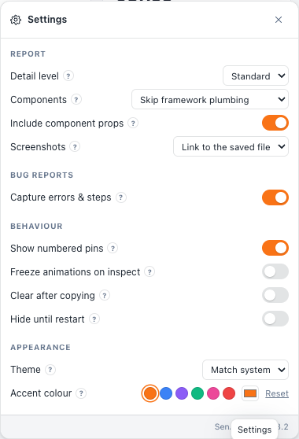
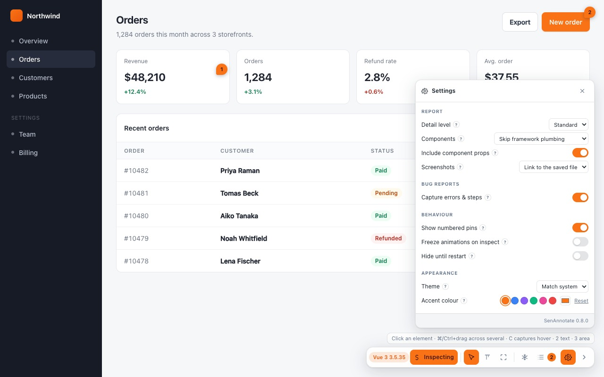

# Settings

The gear on the toolbar — next to the page they describe, rather than behind the
extension icon.

The card follows the pill wherever it is dragged, so it never opens off the edge of the
screen:

Every row carries a **`?`** explaining what it does, because a setting whose effect you
have to guess is one you leave alone.

Settings live in `chrome.storage.sync`, so they follow your Chrome profile to every
machine you are signed in on, and they apply **everywhere** — you set them once, not per
site. The two exceptions are called out below.

---

## Report

### Detail level

How much each note carries into the Markdown. Four levels, and they compose with the
selector in the panel footer — it is the same setting in two places.

| Level | Adds |
|---|---|
| **Compact** | One line per note. |
| **Standard** *(default)* | Component + source. |
| **Detailed** | + classes, bounding box, props, nearby text. |
| **Forensic** | Everything — full DOM path, computed styles, accessibility, environment. |

See [[The Report]] for what each level actually emits, side by side.

**Compact for a quick "these four things"; Forensic when handing a hard bug to an agent
with no other context.** Standard is the right default and most people never move it.

### Components

How hard to work at naming the component chain. Changing the detail level moves this for
you; setting it explicitly overrides that.

| Option | Reports |
|---|---|
| **Skip framework plumbing** *(default)* | Components you wrote, with the framework's internal wrappers dropped. |
| **Only names matching the DOM** | The stricter reading — a component only when its name corresponds to something in the markup. |
| **Every component** | The raw chain, wrappers and all. |
| **Off (fastest)** | No component data. Skips the bridge round trip entirely. |

*Every component* is worth reaching for when a chain looks wrong and you want to see what
the framework actually reports. *Off* is worth reaching for on a very large page where
the round trip is noticeable.

### Include component props

On by default. Adds the owning component's props to the note.

Values that look like credentials are `[redacted]` before storage regardless of this
setting — see [[Diagnostics and Privacy]]. Turn the row off entirely if your props carry
data you would rather never paste into a ticket.

### Screenshots

Whether a captured screenshot is **linked** or **embedded**. See
[[Screenshots and Markup]] — the short version is *link* for a coding agent, *embed* for
Slack or Jira.

---

## Bug reports

### Capture errors & steps

On by default. Records console errors, failed requests and the steps that led there, from
`document_start`.

Turning it off stops the recording — it does not merely hide it from the report. The
capture banner in the panel disappears with it.

**Two things are never recorded either way:** values typed into fields, and request or
response bodies. See [[Diagnostics and Privacy]].

---

## Behaviour

### Show numbered pins

On by default. The numbered markers on the page. Turn them off when they are in the way
of a screenshot you are taking with something else — the notes are unaffected.

### Freeze animations on inspect

Off by default. Makes <kbd>F</kbd> automatic whenever inspect mode goes on.

Worth turning on for a site with a lot of motion — a carousel, entrance animations, a
sticky header that reflows. Worth leaving off elsewhere, because a frozen page is a page
whose own polling has stopped, which is occasionally confusing.

### Clear after copying

Off by default. When on, the page's notes are emptied **once a copy has actually reached
the clipboard** — not merely once you asked for one — so the next round starts clean.

It drops the action trail and the diagnostics with them, exactly as *Clear all* does. The
distinction matters: a failed clipboard write does not lose your review.

### Hide until restart

**The one setting that is per-tab rather than a preference.** Turn it on and the overlay
disappears from *this* tab — reloads included — and stays gone until you close the tab.
Every other tab is untouched.

It is for the moment a demo or a screen-share needs the page clean without turning the
extension off everywhere.

To get it back: close the tab, or open the page in a new one.

---

## Measuring

Three switches: a master, and two indented under it that only appear once it is on.

### Measuring tools

**Off by default**, and the only one of the three you see until you turn it on.

Off is the default because the cost is paid by people who never measure anything: a
fourth clause on the hint line, which is the only thing on screen that explains the modes
at all. With it off, everything reads exactly as it did before measuring existed.

### Measure distances

On by default *under the master* — turning the master on and getting nothing would make
it look broken, and this is the mode it is named after.

Adds mode 4, reached by pressing <kbd>4</kbd> — it has no toolbar button. Click two
elements and the report carries the gap between them in pixels. See
[[Toolbar and Modes]].

Switching it off while you are standing in mode 4 drops you back to mode 1. A mode that
outlives its own button is a mode you can neither see nor leave.

### Box model on hover

Off by default. On, every hover — in any mode — shades the element's padding and margin,
puts its border-box size on a badge, and lists the sides, the type and the colours
underneath.

Mode 4 draws all of it regardless of this switch: measuring without the bands would be
measuring blind. The switch is for the other three modes, where the bands are extra
information rather than the point. That is also why the two are separate switches — you
can read spacing all day without ever wanting a fourth mode button.

---

## Appearance

### Theme

**Match system** *(default)*, Light, or Dark. Applies to the toolbar, the panel, the
composer and the popup.

### Accent colour

Six presets, a picker for an exact brand colour, and a **Reset**. The default is orange.

The colour applies **live, in every open tab**, to:

- the highlight and its label
- the toolbar and the pins
- the count badge on the extension icon
- the popup
- the boxes and arrows you draw on a screenshot

Screenshots you already saved keep the colour they were drawn in.

The text-on-accent shade is derived from the colour's own brightness, so a dark accent
gets light text rather than unreadable dark-on-dark. There is no separate setting for it
and no way to get it wrong.

---

## The footer

The card's footer shows **which version you are running**, so a bug report can name it.

---

## Where settings do not reach

On `chrome://` pages, the Chrome Web Store and the PDF viewer there is no toolbar, so
there is no gear to open — **including for theme and accent**, which are otherwise
global. Open any ordinary page and set them there; they apply everywhere immediately.

The extension popup carries the session tools rather than the settings, for exactly this
reason — see [[Sessions Export and Import]].
