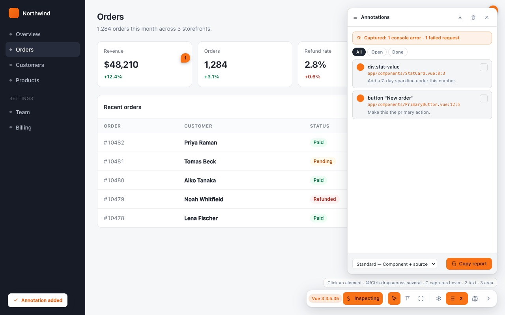

# The Annotations Panel

The list of what you have found on this page, the filter over it, and the button that
turns it into a report. <kbd>A</kbd>, or the list icon on the toolbar.

---

## Top to bottom

### The capture banner

> ⚠ **Captured: 1 console error · 1 failed request**

What the extension recorded on this page **without being asked**, from before the app's
first line ran. It is shown here rather than buried in the report because it is often the
most useful thing on the screen and you would otherwise never know it existed.

Absent when nothing was captured, and absent entirely when *Capture errors & steps* is
off. See [[Diagnostics and Privacy]].

### The filter

`All · Open · Done` — see [[Triage]].

### The entries

One row per note:

- **The pin dot**, coloured by type.
- **The element name** — `button "New order"`, `td "Priya Raman"`. Struck through when
  the note is done.
- **The source line**, when the framework gave one.
- **Your note.**
- **The tick**, on the right, which marks it done.

Click a row to reopen it in the composer. The page scrolls to the element and highlights
it, so a list of twenty notes is still navigable.

### The footer

| Control | Does |
|---|---|
| **Detail level** | How much each note carries in the report — see [[The Report]]. |
| **Copy report** | Puts the Markdown on your clipboard. |

### The header icons

| Icon | Does |
|---|---|
| ⤓ | Saves the report as a `.md` file instead of copying it. |
| 🗑 | **Clear all** — deletes every note on this page. |
| × | Closes the panel. |

**Clear all** also drops the action trail and the diagnostics with it. It is scoped to
this page; other pages are untouched. To clear everything everywhere, use **Clear all
pages** in the popup — see [[Sessions Export and Import]].

---

## In context

The panel docks against the toolbar rather than floating, so it never covers the corner
you dragged the toolbar away from:

---

## Pins

Every note leaves a numbered pin on the page at the element it belongs to, coloured by
type. The numbers match the report's headings, so "number 3" means the same thing in the
list, on the page, and in the ticket.

Turn them off with *Show numbered pins* in [[Settings]] when they are in the way of a
screenshot you are taking with something else.

Pins reposition on scroll and resize. Two cases they cannot follow: an element inside an
iframe scrolling *within that frame*, and an element the page has removed. Neither
affects the report.

---

## Where notes live

Keyed on **`origin + pathname`**. The query string is deliberately excluded, so
`/orders?page=2` and `/orders?page=3` share one set of notes — pagination is not a
different screen.

| | |
|---|---|
| Notes | `chrome.storage.local` |
| Settings | `chrome.storage.sync` — so they follow your Chrome profile |
| Survive a reload | Yes |
| Survive an extension upgrade | Yes — the keys have not moved since 0.2.0 |
| Survive uninstalling | **No.** Export first. |

---

## Copying without the clipboard

**Copy report** writes to the clipboard directly. If a browser policy blocks clipboard
access, use ⤓ to save the `.md` file instead — same text, no clipboard involved.

One implementation detail with a visible consequence: copying must not `await` anything
before touching the clipboard, because an await spends the click's user activation and
`navigator.clipboard.writeText` then silently stops working. That is why the content
script keeps its own mirror of the diagnostics buffers rather than fetching them when you
press the button.
