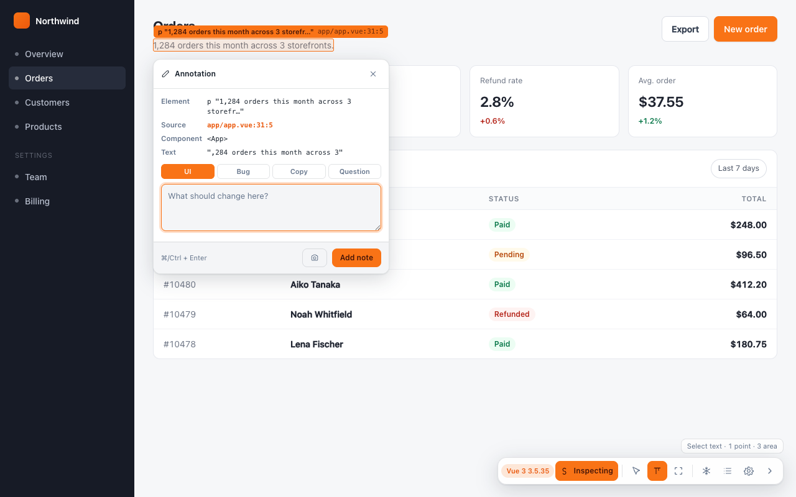

# Toolbar and Modes

The toolbar is the whole interface. There is no options page you have to find and no
DevTools panel to dock — settings, the annotation list and the modes all live on the pill
in the corner, next to the page they describe.

---

## Anatomy, left to right

| | Button | Does | Key |
|---|---|---|---|
| `Vue 3 3.5.35` | **Stack badge** | Names the framework found on this page. Absent when none was found; **amber** on a production build. Not a button. | — |
| `S Inspect` | **Inspect** | Turns inspect mode on and off. Reads **Inspecting** while on. | <kbd>Alt</kbd>+<kbd>Shift</kbd>+<kbd>S</kbd> |
| ⌖ | **Click an element** | Mode 1 — the default. | <kbd>1</kbd> |
| T | **Select text** | Mode 2. | <kbd>2</kbd> |
| ⛶ | **Drag across elements** | Mode 3 — the marquee. | <kbd>3</kbd> |
| ❄ | **Freeze animations** | Parks `requestAnimationFrame` and `setTimeout` in the page. | <kbd>F</kbd> |
| ☰ ③ | **Annotations** | Opens the panel. The badge is the count on this page. | <kbd>A</kbd> |
| ⚙ | **Settings** | Opens the settings card. | — |
| » | **Collapse toolbar** | Collapses to a dot. | <kbd>H</kbd> |

**The three mode buttons only appear once inspect mode is on.** They are icon-only, which
is exactly why the hint line exists.

---

## The hint line

The line above the pill always names what the current mode does and which keys reach the
others:

| Mode | Line |
|---|---|
| Click an element | `Click an element · ⌘/Ctrl+drag across several · C captures hover · 2 text · 3 area` |
| Select text | `Select text · 1 point · 3 area` |
| Drag across elements | *(names the drag, and the keys back)* |

It also becomes a live counter while you are assembling a selection —
`3 elements picked · ⌘/Ctrl+click to add · Enter to annotate` — so you can see what you
have before committing to it.

This line exists because of a real failure: the marquee mode shipped and went **unused
for three releases**, because nothing on screen said it existed. Every button also names
itself on hover *and* on keyboard focus, for the same reason.

---

## Modes

### 1 · Click an element

The default. Hover outlines an element and labels it; click annotates it. Most work
happens here, and the two other selection gestures — <kbd>⌘</kbd>/<kbd>Ctrl</kbd>+click
and <kbd>⌘</kbd>/<kbd>Ctrl</kbd>+drag — work from inside this mode without switching.

### 2 · Select text

Select a text range and the composer opens with a **Text** row carrying what you
selected. Use it when the complaint is about wording rather than about a box.

### 3 · Drag across elements

Draw a box; everything it **fully contains** is taken. See [[Selecting Elements]].

---

## Freeze

<kbd>F</kbd> parks the page's animations: `requestAnimationFrame` and `setTimeout` are
held, so a carousel, a toast on a timer, or a CSS transition mid-flight all stop where
they are and can be annotated.

Two things worth knowing:

- **It has to run in the page's own world to work.** Patching `setTimeout` from an
  isolated content script patches only that script's timers; the page's animation loops
  live in a different heap. See [[Architecture]].
- **It does not help with hover-driven surfaces.** A dropdown that closes on mouse-out is
  driven by pointer events, not by time, so freeze has no effect on it. <kbd>C</kbd> is
  the answer there — see [[Selecting Elements]].

*Freeze animations on inspect* in [[Settings]] makes it automatic whenever inspect mode
goes on.

---

## Moving the toolbar

The pill docks bottom-right, which is exactly where a page tends to put its chat widget,
cookie bar or footer actions. So: **drag it anywhere.** Grab any part of the pill,
buttons included — a press that travels more than a few pixels moves it instead of
clicking it.

The position is remembered **per page**, the same way annotations are. Move it clear of
the checkout page's order summary and it stays there on that page, while every other page
keeps the default corner. Open the same page in a narrower window later and it is clamped
back into view rather than stranded off-screen.

The settings card follows the pill wherever it is dragged, so it never opens off the edge
of the screen.

---

## Collapsing

<kbd>H</kbd> — or the `»` button — collapses the toolbar to a single dot that still
carries the annotation count.

**Collapsing means *get out of the way*, not merely *get smaller*.** It also:

- leaves inspect mode, and
- closes whichever card is open.

That is deliberate. A toolbar you have just dismissed which is still swallowing every
click — so the next one opens a composer for no reason the screen can explain — is the
exact failure this behaviour prevents.

Expanding gives none of it back. <kbd>H</kbd> asked for the toolbar, so <kbd>H</kbd>
returns the toolbar, and nothing else. Freeze is untouched either way, because freeze is
a property of the page rather than of the toolbar.

The collapsed state is a **setting**, not a session flag, so a reload does not put the
pill back over the corner you were looking at. <kbd>H</kbd> works whether or not inspect
mode is on, unlike the mode keys.

---

## Escape

<kbd>Esc</kbd> closes the innermost thing first, in this order:

1. a tooltip
2. the open card — composer, settings, or the markup editor
3. a half-built pick set
4. the panel
5. inspect mode

So <kbd>Esc</kbd> is always safe to press: it never skips a level, and it never throws
away more than the one thing you were most recently in.

---

## Where the toolbar is not

On `chrome://` pages, the Chrome Web Store and the PDF viewer, Chrome does not run
extension content scripts at all. There is no toolbar there and nothing can put one
there — including for theme and accent, which are otherwise global settings. Open an
ordinary page instead.

**Hide until restart** in [[Settings]] removes the overlay from one tab deliberately.
If the toolbar is missing where you expect it, that is the first thing to check —
see [[Troubleshooting]].
